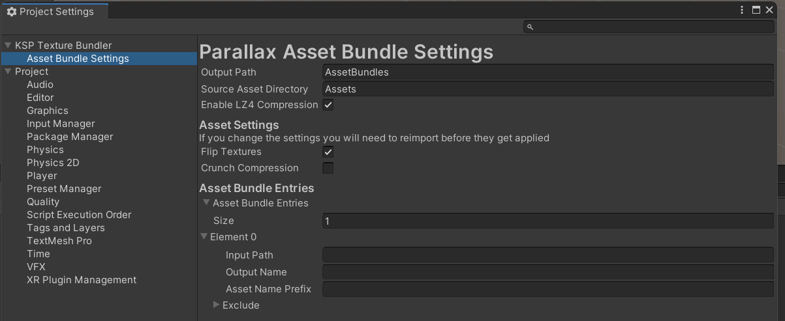
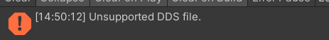

# KSP Texture Bundler
This is a package for the unity editor that is meant to allow you to easily
create asset bundles that are compatible with Parallax Continued and also
(in the future) other graphics mods in the KSP ecosystem.

## Installation
To install the KSP texture bundler:
* Open the Unity Package Manager in your Project (menu: Window > Package Manager)
* Click the + (Add) button at the top-left corner of the window.
* Chose Add package from git URL...
* Enter <https://github.com/Phantomical/KSP-Texture-Bundler.git> as the URL.
* Click Add. The package manager downloads and installs the package's "main" branch.

Once installed it will add:
* A new entry in the project settings (KSP Texture Bundler > Asset Bundle Settings)
* A new menu entry (menu: KSP Texture Bundler > Build Asset Bundles)

## Getting Started
Before doing anything else you should open up the project settings window
(menu: edit > Project Settings) and go to the Asset Bundle Settings screen.

Create asset bundle entries for all of the asset bundles you intend to
create for your mod. The entries you need to fill out are:
* **Input Path** - A directory containing assets to include in your asset
  bundle. The names of the assets within the bundle will be relative to
  this directory.
* **Output Name** - The path to place the resulting bundle within the
  configured output directory (the Output Path option at the top of the
  settings).
* **Asset Name Prefix** - A directory prefix to prepend to the names of all the
  assets within the bundle. This is useful if you're trying to use the same
  asset names both inside and outside of the bundle.
* **Exclude** - Files to exclude from the bundle. This should be in the form
  of file name globs, not paths.

Once you have your settings set up the way you want them you should import your
texture assets. If they are already in the project then you will need to reimport
them. _This will take a while_. If you are mostly dealing with 4k textures expect
a couple minutes to import everything, for 16k textures this will take longer.

After you have everything imported the way you want, you can build the asset
bundles by hitting (menu: KSP Texture Bundler > Build Asset Bundles). The bundles
will be placed under the directory you configured in the settings. By default this
is `AssetBundles`.

## Common Warnings and Errors
* If you are importing L8 or R16 dds textures then you will see
  

  in the output logs. This is harmless, unity doesn't know how to import these
  but this package manually imports them.

* DDS textures whose width/height are not multiples of 4 seem to cause errors
  when they are imported into KSP (with DX11, I don't know about with other
  APIs). The postprocessing step will automatically resize any 1x1 textures to
  4x4 but larger textures should be excluded from the asset bundle.

## Limitations
* Unity 2019.4 cannot create asset bundles that are larger than 4GB in size when
  uncompressed. If your textures are larger than 4GB total then you will need to
  split them up into multiple asset bundles.
* Unity 2019.4 does not allow you export a source texture (i.e. anything but DDS)
  as larger than 8192x8192. If you want to use 16k textures then you will need to
  convert them to dds textures outside of unity and import the dds textures.
* There is no support for bundling cubemaps directly at this time. You should
  continue to use parallax's format for cubemaps in a 

## Best Practices
* When textures are imported they will use the import settings as defined in the
  unity editor. Make sure that your import settings match what you want.

  By default, parallax imports textures like so:
  * All textures have `isReadable` set to false (except cubemaps, see below)
  * Bump, displacement, influence, wind, and height textures are linear (i.e.
    have `sRGB` set to false).

  These are a good starting point for your own configuration.

  Cubemaps must have `isReadable` set to true so that parallax can read the
  pixels from them to build the actual cubemap.

* Ideally you should have one asset bundle for your entire mod. This will avoid
  situations where you need to keep some assets as loose textures because it is
  needed for multiple asset bundles.

* If you are using DXT1 and DXT5 textures then you can use crunch compression
  to reduce their size on disk. For non-dds textures, you can set this directly
  in the import settings. For dds textures you can set the "Crunch Compression"
  option in the settings.

  Be aware that this will make imports quite a bit slower. I have also seen
  issues where crunch compression doesn't work properly, which is why it is
  disabled by default.

